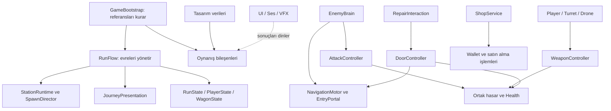

# Mimari ve sistem sözleşmeleri

Bu belge hedef yapıyı tarif eder; adı geçen sistemlerin bir kısmı henüz uygulanmadı. Uygulanan navigation, ortak can/hasar, tek vagon ve iki vagonlu koşu bileşenlerinin gerçek doğrulama sınırları `NAVIGATION_LAB.md`, `COMBAT_LAB.md`, `GAMEPLAY_LAB.md` ve `RUN_LAB.md` içinde listelenir. Kesin tasarım kararları `DECISIONS.md` içinde, doğrulama işleri `ROADMAP.md` içindedir.

D22 hedef denetimi: kare/tek kapılı laboratuvar ürün mimarisi kabul edilmez. Denetimde saptanan tek kapı bağı, portal yarı düzleminden üyelik ve sabit doğuş/güvenli noktalar M6a'da WagonGeometry ile iki tarafa/çok kapıya genellendi. D23 güncel ölçek/kamera referansıdır; D24 yan pencereden atışı ekler. Somut geçmiş `VISION_AND_INTEGRATION.md`, güncel geometri/model bağlama `VISUAL_SCALE.md` ve `MODEL_CONTRACT.md` içindedir. Döngü/hasar testlerinin geçmesi tek başına yeni geometri entegrasyonunun kanıtı sayılmaz.

## Temel yaklaşım

Her sistem kendi durumunu yönetir; diğer sistemlerin iç değişkenlerini düzenlemez. Açık metotlar ve dar sözleşmeler üzerinden işlem yapılır. Sonuçlar tipli olaylarla bildirilir. Her şeyi tek bir global event bus'a bağlamak veya her sınıfa arayüz eklemek hedef değildir.

Başlangıçta klasik GameObject/MonoBehaviour + Unity AI Navigation yeterlidir. ECS/DOTS, genel amaçlı behavior tree frameworkü veya üçüncü parti DI frameworkü bu aşamada eklenmez. Performans sorunu ölçülürse ilgili darboğaz için karar verilir.

Minimum mobil girdi adaptörü ve tabanca M3'ün ilk oynanabilir parçasında bulunur; M5 bu çekirdeği genişletir. M1'de kaba Android kalabalık ölçümü yapılır. FPS düşüklüğünün kaynağı ayrılmadan navigation motoru değiştirilmez; kapı çevresi sıra/saldırı slotları NavMesh'in yanında kullanılabilir. M4 önce iki vagonda doğrulanır, sonra veri/prefab bağlantılarıyla beş vagona çıkar.

D15/D16: kapının geçiş engeli ile atış engeli ayrıdır. Sağlam cam oyuncu ve ileride turret atışını geçirir; dolu panel/duvar isabeti keser. Silah hedefleme görüşü ve gerçek isabet aynı `hitMask` kullanır. `ShotTransparent` sadece uygun geçiş colliderlarında kullanılır; melee/nav/karakter çarpışması bu katmanı görmeye devam eder. Oyuncunun dışarı çıkma izni Player modülündeki isteğe bağlı `MovementArea` ile uygulanır; ek duvar colliderı veya zombi yolunu kesen NavMesh engeli değildir. Görev/vagon bağlamı alanı açıkça atar veya kaldırır.

Doğrulama riske göre ölçeklenir: saf hasar/can kuralları otomatik test, ilk mekânsal davranışlar küçük sahnede elle kontrol edilir. Havuz/abonelik/eski callback kuralları ilgili özellik eklendiğinde doğrulanır. Her sınıfa test veya henüz kullanılmayan kayıt altyapısı kurmak hedef değildir.

`RunFlow` işlemleri koordine eder; düşman AI'ını, silah matematiğini veya kapı canını kendi içinde uygulamaz. `GameBootstrap` bağlantıları Inspector/kurulum kaydı üzerinden kurar; çalışma sırasında herkesin `Find` yaptığı bir servis değildir.

## Sahiplik ve sınırlar

| Modül | Sahip olduğu durum / iş | İzin verilen bağlantı |
| --- | --- | --- |
| Run | Etap indeksi, evre, zaman, koşu sonu | İstasyon/yolculuk/atama servislerini çağırır. |
| Train/Wagons | Vagon kimliği, kapı/slot kayıtları, içerideki düşman üyeliği | Portal, hasar ve savunma sözleşmeleri. |
| Navigation | Yürünebilir alan, portal geçişi, yol/konum geçerliliği | Kapı geçiş durumu ve istasyon bağlantısı. |
| Combat | Can, hasar kuralları, ateş aralığı, isabet, ölüm | Hasar alabilen hedef ve kaynağın takım/sahiplik bilgisi. |
| Enemies | Hedef seçimi, davranış durumu, saldırı zamanlaması | Navigation, Combat, vagon bağlamı. |
| Spawning | Üretim programı, canlı sınırı, havuz, kayıtlar | İstasyon ve enemy factory. |
| Player | Girdi, hareket, etkileşim ve ekipman | Combat ve etkileşim hedefleri. |
| Defenses | Turret slotu, dron takibi, hedef seçimi | Ortak silah, hedef kayıtları ve sahiplik. |
| Economy | Para ve ürün işlemi | Dar iyileştirme/onarım/ekipman/kurulum işlemleri. |
| Presentation | UI, animasyon, ses, efekt ve kararma | Oynanış sonuçlarını okur; can veya ödül üretmez. |

`WagonId`, `DoorId`, `SlotId` sahne içinde sabittir. Havuzlanan nesnenin runtime kimliği yaşam kuşağıyla birlikte değişir. Aynı nesne başka zombi olarak yeniden kullanıldığında eski hedef/mermi referansı onu vuramaz.

Önerilen klasörler: `Assets/Game/{Core,Runtime,Presentation,Bootstrap,Content,Scenes,Tests}`. Runtime içinde `Run`, `Train`, `Navigation`, `Combat`, `Enemies`, `Spawning`, `Player`, `Defenses`, `Economy` bulunur. Satın alınmış asset klasörleri korunur.

Assembly sınırları ihtiyaç oldukça kurulur: Core (küçük sözleşmeler ve saf mantık), Runtime (Unity oynanış adaptörleri ve içerik verileri), Presentation (Runtime/Core okuyabilir), Bootstrap (hepsini bağlar). Runtime, Presentation'a bağımlı olmaz. İlk işte onlarca assembly veya boş sınıf oluşturulmaz.

ScriptableObject tanımları tasarım verisidir: `EnemyDefinition`, `WeaponDefinition`, `WagonDefinition`, `DefenseDefinition`, `StationDefinition`, `ItemDefinition`. Mevcut can, kalan mermi, para, onarım ilerlemesi ve dalga sayacı bu assetlerde tutulmaz; nesne/koşu başına runtime durumudur.

## Sabit oynanış zemini ve tren yolculuğu

Kararlaştırıldı: trenin gameplay kökü sabittir. Teker, ışık, kamera, ses ve çevre hareketi yolculuk hissini oluşturur. Bu tercih kullanıcının görsel hareket hedefini karşılar; dünyada gerçekten hareket eden platform navigasyonu ilk kapsamdan çıkar.

`GameplayTrainRoot`, istasyonun gameplay zeminleri ve `EnvironmentVisualRoot` ayrıdır. Sadece görsel çevre taşınır; yürünebilir zemin veya çarpışma geometrisi onunla yanlışlıkla taşınmaz. Yeni istasyon, aynı yanaşma alanına kurulur; görünür çevre ayrı sunulur.

2026-10-08 uygulaması: `RunPresentation`, `JourneyMotion` üzerinden tek `RunFlow` evresini okuyarak üç görsel kökü sürer: ray/travers (2 birim tekrar), yol çevresi (20 birim tekrar) ve istasyon (tekrarsız). İstasyon yaklaşırken yavaşlayıp savunma/kalkış uyarısında sıfır ofsete oturur; hızlanırken geride kalır. Sonraki istasyon yalnızca tam karanlıkta değiştirilir. Kapanış anındaki konum terminal evrede korunur. Can, spawn, üyelik veya NavMesh kararı bu sunumdan verilmez; modlar aynı evre sözleşmesiyle sunumu kullanabilir.

Lab builder'ı sabit istasyon colliderının Renderer'ını kapatır; aynı konum/ölçüde ayrı collider taşımayan görsel platform kurar. Collider, baked yüzey, spawn/kapı/onarım çapaları vagon gameplay kökünde kalır. Dış zombi yalnızca durmuş istasyonda üretilir; kalkışta dışarıdakiler mevcut üyelik politikasıyla havuza döner, içeridekiler vagonlarında kalır. Böylece canlı bir dış agent hareketli görsel zeminin üzerinde bırakılmaz. Gerçek modeller bu ayrı köklere giydirilmeli; model colliderı, root motion veya NavMeshSurface hareketli görsel köke eklenmemeli. Gelecekte istasyona inme görevi yalnızca duruşta izin vermeli veya ayrı hareket/üyelik tasarımı gerektirir.

Vagon içi ve istasyon dışı yürünebilir alanlar önceden bake edilir. Kapı değişiminde bütün NavMesh yeniden bake edilmez. İlk yaklaşmada bir istasyon kurulup nav verisi, doğuş noktaları, vagon/portal eşleşmesi doğrulanır; hazır olmadan spawn başlamaz. Kurulum karanlıkta yapılsa bile başarısızlıkta koşu savunmaya geçmez.

NavMesh'in yüzey konumunu güncellemesi ile üzerindeki karakterleri güvenle taşıması farklı işlerdir. Kurulu AI Navigation 2.0.14 kaynağında yüzey transform değişiminde veri kaldırılıp yeniden ekleniyor; bu, agent/physics/oyuncu taşımasını tek başına garantilemez. Gerçek platform hareketi gelecekte istenirse ayrı teknik deneme ve karar gerektirir.

## Kapı bir geçiş noktasıdır

Her `EntryPortal`: `WagonId`, `DoorId`, dış yaklaşma/saldırı noktaları, iç varış noktası ve fiziksel giriş bölgesi içerir. Kapı sağlık/durumunun sahibi `DoorController`; yürünebilir geçişin sahibi navigation adaptörüdür. Bitişiğe yakın istasyon/vagon zeminlerinde tercih, kesintisiz bake edilmiş NavMesh ve yalnızca kapı açıklığını kesen carving obstacle'dır. Enemy brain bunun uygulamasını bilmez. İlk link deneyi ve sonraki düzenleme `NAVIGATION_LAB.md` içinde kayıtlıdır.

Kapalı kapıda içeriye alternatif bir polygon yolu kalmaz; obstacle bütün kapı açıklığını keser. Açık kapıda agent normal zeminde yürür, off-mesh linkin tek-agent geçiş kilidini kullanmaz. Yüzeylerin gerçekten ayrık olduğu farklı geometride kontrollü link hâlâ ayrı bir seçenek olabilir; mevcut yakın zeminli vagon kapısında sabit ikili hat tercih edilmez. Kapı değişiminde bütün yüzey yeniden bake edilmez. Carving sorgu sonucu bir navigation güncellemesi sonra değişir; rota kontrolü bunu dikkate alır.

| Koşul | Yeni geçiş kabulü | Fiziksel kapı | Zombi kararı |
| --- | --- | --- | --- |
| Yanaşmış + kapı sağlam | Kapalı | Engelleyici | Dış saldırı noktasına git; menzildeyse kapıya saldır. |
| Yanaşmış + kapı kırık | Açık | Engelleyici collider kapalı | İçeri geç; içerideki hedefe yönel. |
| Onarım tamamlanıyor, geçit dolu | Yeni giriş kapalı; mevcut geçiş yönetilir | Alan boşalana kadar açık | Dışarıdakiler bekler/kapı planını yeniler. |
| Kalkış | Yeni dış giriş kapalı | Kapı canına göre | Tamamlanmış içeri girişler trende kalır. |
| Yolculuk | İstasyona bağlantı kapalı | Kapı canına göre | İç zombiler vagon içinde davranışını sürdürür. |

Kapı onarımında yalnızca nav yolunu kesmek ve colliderı anında açmak yeterli kabul edilmez. Geçit bölgesi işgali, geçmekte olan agent ve oyuncu fiziksel çakışması kontrol edilir. Geçiş adaptörü yeni giriş hedeflerini engeller; eşikteki agent mevcut geçiş yönünde ilerler. Alan sürekli doluysa kapanış bekler; timeout karakteri duvara ışınlamaz. Bekleme UI'da gösterilebilir. Labdaki SetOpen düğmesi nihai kapı controller'ı değildir; M3/M4'te kapı sağlamlığı ile istasyondan giriş izni ayrı girdiler olarak bağlanır.

Kalkış için sonlu bir kural gerekir: yeni girişler kapatılır; geçitteki agentın içeride/dışarıda olma kararı tanımlı eşik ile sabitlenir. İç tarafta kabul edilmiş agent güvenli iç varışa yerleştirilir ve `OnBoard` olur; dış tarafta kalan agent istasyon grubunda kalır. Bu normal girişte teleport yöntemi değildir; yalnızca istasyon ayrılma sınırındaki temizliktir. M4'te gerçek geometrilerle doğrulanır.

Portal durumunda her değişiklik bir sürüm üretir. Yalnızca ilgili zombilerin planları geçersizleşir; her kapı olayında bütün düşmanlar aynı karede yeniden path hesaplamaz. Eski geçiş, slot ve hedef rezervasyonları ölüm/havuza dönüşte bırakılır.

## Ortak can ve hasar

Minimum sözleşmeler: `IDamageable.TryApplyDamage(context)`, `Health.TryHeal(amount)` ve `Health.ChangeMaxHealth(...)`. Kapı, zombi ve oyuncu aynı hasar kurallarına uyar; özel kurallar veri/ayrı bileşenle eklenir.

`DamageContext`: miktar, hasar türü, kaynak runtime kimliği/kuşağı, takım, ödül sahibi ve saldırı kimliği. Sonuç: uygulanan gerçek hasar, reddedilme nedeni, ölüm olup olmadığı. `HealthChanged`, `Died`, `DoorStateChanged` gibi sonuçlar UI/AI tarafından dinlenir.

- `0 <= CurrentHealth <= MaxHealth`; negatif hasar/iyileştirme geçersizdir, iyileştirme hasar API'sinden geçirilmez.
- Ölü hedef tekrar hasar/ödül üretmez; iyileştirme otomatik diriltmez.
- Bir yaşamda ölüm ve ödül en fazla bir kez uygulanır. Aynı karede iki mermi öldürse bile tek ödül çıkar.
- Takım, dokunulmazlık ve hedef türü kuralları ortak yerde uygulanır. Zırh ve bağışıklık sonraki eklerdir.
- Maksimum can değişiminde mevcut canın korunması/doldurulması ürünün açık kuralıdır; kendiliğinden yüzdeye ölçeklenmez.
- Patlama, aynı hedefin birden fazla colliderını tek hedef olarak işler. Pompalı saçmaları ise tasarım gereği farklı isabetler olabilir.
- Animasyon/VFX ölüm kararı vermez. Zombi saldırısında önce telegraph, sonra tek vuruş zamanı; bu anda hedef hâlâ canlı, erişilebilir ve menzilde mi kontrol edilir.
- Pool temizliği, sahneden kaldırma ve gerçek öldürme farklı nedenlerdir. Ödül yalnızca gerçek öldürme sonucunda verilir.

## Silah, turret ve dron aynı çekirdeği kullanır

`WeaponController`: ateş aralığı, mermi, ateş yetkisi ve silah verisi. `HitResolver`: raycast/pellet veya gelecekte sweep yapan projectile. `TargetSelector`: oyuncuda nişan, turrette menzil/görüş, dronda oyuncuya yakın hedef. `WeaponPresentation`: namlu/mermi/çarpma/ses.

M5 uygulamasında bunların karşılığı `HitscanWeapon` + saf `WeaponState/WeaponSpec`, `HitscanResolver`, mevcut `AutoAim` ve kozmetik `ShotTracer/MuzzleFlash` bileşenleridir. Silah runtime'ı Player/Run/Shop modüllerini bilmez. Tanımlar tasarım verisi; her ekipmanın şarjör/yedek/dolum durumu nesneye aittir. D19 sınırlı yedek ve tam/kısmi otomatik dolum uygular. Doğrulama ve savunma/cihaz entegrasyonunun açık sınırları WEAPONS_LAB.md içinde.

Efekt prefabının colliderı tekrar hasar vermez; hitscan sonucu tek otoritedir. Görsel mermi gerçek isabet noktasına doğru oynatılır. Assetteki `HS_ProjectileMover` doğrudan can sisteminin sahibi yapılmaz; adaptör veya ayrı görsel prefab ile kullanılır.

Fiziksel projectile gerekiyorsa hareket boyunca ray/sphere sweep, kendi yaşam süresi ve pool iadesi vardır. Hızlı merminin hedefi atlaması ve eski havuz kimliğine hasar vermesi test edilir.

Atış sadece geçerli atışta mermi tüketir. Aralık 1 saniye ise saniyede 1 atış; veri adı `FireIntervalSeconds` kullanılır, rate ile ters anlam karıştırılmaz. Düşük FPS telafisi sınırlıdır; tek karede sınırsız atış biriktirilmez.

Turret/dron hedef araması her kare tüm sahneyi taramaz. Kayıtlı adaylar, sınırlı sıklık ve tekrar kullanılan sorgu bufferları kullanılır. Buffer dolması sessizce yanlış sonucu doğru kabul ettirmez; tanı sayacı veya kontrollü alternatif gerekir. En yakın adayın önü kapalıysa diğer geçerli aday değerlendirilir.

Kamikaze/patlama için ayrı durum makinesi vardır: normal → mermi bitti → hedefe yönel → bir kez patla → havuza dön. Oyuncuya ait ödül sahipliği korunur; dronun sahibinin yaşamı değişirse eski işlem devam etmez.

## Zombi davranışı ve kalabalık

İlk davranış küçük, açık durum makinesi: `Spawning`, `ApproachingPortal`, `AttackingDoor`, `EnteringWagon`, `SeekingTarget`, `AttackingTarget`, `WaitingForRoute`, `Dying`. Her tür aynı temel hareket/hasar/yaşam döngüsünü kullanır. Özel türler gerekli karar veya saldırı stratejisini değiştirir.

`EnemyBrain` karar verir; `NavigationMotor` agentı sürer; `AttackController` zamanlama/hasarı yönetir. Agent hareketin tek sahibidir. Yaşayan zombide dynamic Rigidbody ve root motion aynı transformu eşzamanlı sürmez. Fizik teması gerekiyorsa uygun kinematic gövde; ragdoll sırasında agent kapatılır. Ragdoll sayısı mobilde sınırlıdır.

Kapının sınırlı saldırı konumları vardır. Ön sıradakiler saldırır, kalanlar arkada bekler/yeni portal seçer. Bu, bütün kalabalığın aynı noktaya zorlanmasını ve saldırı sayısının kontrolsüz büyümesini önler. Slotlar ölüm, rota değişimi ve kapı kırılmasında serbest bırakılır.

AI kararları başlangıç denemesi olarak dağıtılmış 0.1–0.25 saniye aralıklarla; hareket Unity agent simülasyonunda sürer. Path yenileme hedef yeterince hareket edince veya ilgili portal değişince yapılır. Aralıklar cihaz ölçümüyle ayarlanır. Uzak vagonlarda karar sıklığı azaltılabilir; hasar/ödül ve vagon durumları görünmüyor diye durmaz.

## Spawn, pooling ve istasyon yaşam döngüsü

D23 ile fiziksel authoring `WagonLayoutDefinition` varlıklarından gelir: gövde ölçüleri, 4–6 kapı maskesi ve dayanıklılık. Builder bunlardan gameplay colliderı, portal, doğuş ve bake üretir; eksik kapı duvar olur. Runtime görsel modelin mesh boyutlarına bağımlı değildir. Görsel çocuklar değiştirilebilir; fizik/nav kökü scale=1 kalır. Responsive perspektifin tek sahibi RunPresentation, saf kadraj hesabı WagonCameraFraming'dir; ekran safe area ve sınırlı takip korunan hacmi bozmaz. Ayrıntılar VISUAL_SCALE.md.

M6a uygulamasında `WagonGeometry` (Train assembly) gerçek yerel iç hacmi, kapı listesini, istasyon doğuş çapalarını ve güvenli iç adayları taşır; Player/Enemies/Run bağımlılığı yoktur. `EnemyPool` doğuşta aynı taraftaki erişilebilir kendi-vagon girişini yeniden kullanılan NavMeshPath ile seçer. `EnemyBrain` üyelikte bütün hacmi, eşik güvenliğinde tüm kapıları kontrol eder; portal yarı düzlemi yalnız eski tek-kapılı lab fallback'idir. `WagonRuntime` geometri çapalarını kullanır. `MovementArea` oyuncunun kaldırılabilir sınır kuralı olarak ayrı kalır. Platformlar kesintisiz ortak NavMesh'tir; sahiplik WagonId/geometri verisidir. Sabit collider/nav ile hareketli sunum ayrıdır. Kamera X takibini yalnız RunPresentation sürer. Sahne bağlama/kurulum ve kanıt: [TRAIN_INTEGRATION.md](TRAIN_INTEGRATION.md).

`SpawnDirector` programı uygular; `EnemyFactory` havuzdan alıp tam `SpawnContext` ile başlatır: runtime kuşağı, `WagonId`, tür, hedef profili, etap çarpanları, istasyon kimliği ve ödül sahibi.

Kurulum sırası: veriyi doğrula → uygun spawn/rota adayını bul → canlı sınırı kontrol et → havuzdan al → tüm durumu sıfırla → nav zemine yerleştir → kayıt/aktivasyon. NavMesh'e uygun olmayan nokta sınırlı sayıda yeniden denenir; sonsuz deneme veya duvarın ötesindeki en yakın polygona rastgele atama yapılmaz.

Global ve vagon başına canlı sınırları, spawn bütçesi ve kare başına üretim sınırı vardır. Sınır dolunca istek program kuralıyla ertelenir veya atlanır; bekleyen kuyruk da sınırlıdır. Trende kalan zombiler global canlı sınırına dahildir. Dışarıda bırakılanlar yeni istasyon bütçesine sızmaz.

Ölümde canlı kaydı derhal çıkar; kısa ölüm efekti/corpse ayrı bütçeyle kalabilir. Geri vermede sağlık, davranış, path, hedef, portal/slot, zamanlayıcı, ses, animasyon, subscription ve eski coroutine işlemleri sıfırlanır. Stale callback yaşam kuşağı kontrolüyle etkisiz kalır.

Bir istasyonun bitmesi bütün treni yeniden yüklemez. `StationRuntime` kendi spawn programını ve dış zombilerini kapatır. `OnBoard` zombiler vagon kaydında devam eder. Yeni istasyonun başlangıcı eski zamanlayıcılardan bağımsızdır.

## Koşu durumu, atama ve görünmez geçiş

M4a uygulaması: `WaitYourTurn.Run` ayrı assembly; `RunFlow` saf evre/süre kuralları, `RunDriver` sahne adaptörü, `WagonRuntime` vagon bağlamı, `StationSpawner` sınırlı ilk spawn adaptörü, `RunPresentation` görsel hareket. Combat/Navigation/Train/Player/Enemies çekirdekleri Run'a veya Sandbox'a referans vermez. HUD yalnızca gözlemler/test sürer. Gerçek uygulama ayrıntıları ve geçici hedefleme/doğuş sınırları `RUN_LAB.md` içinde.

Mod hedefleri ortak çekirdeğin üstünde ayrı politikalar olacaktır: Battle bot aktörleri/eleme/sıralama ve botsuz ilerleme. Şimdiki tek insan ölümü koşuyu bitirir; gelecekte bot ölümü bütün koşuyu bitirmemeli, mod politikası bunu seçmelidir. Zombi brain'i kendi vagon hedef bağlamını kullanır; başka vagondaki oyuncuya global takip yapmaz. Botlar aynı hareket/hasar/atış/onarım kurallarını girdi/karar adaptörüyle kullanacak; Google kayıt SDK'sı bu kurallara bağımlılık olarak girmez.

`RunState`: etap, seed, evre. `PlayerState`: can, para, ekipman, dron. `WagonState`: kapı canları, turret slotları/mermileri ve içerideki düşmanların canlı runtime kayıtları. Aynı sahnede korunan nesneler ilk uygulamadır; tüm dünyayı diskten yeniden kurmak ilk aşama değildir.

Rastgele atama evre başına bir kez yapılır. Oyuncu prefabı yeniden yaratılmaz; hareket motorunun güvenli yeniden konumlandırma metodu kullanılır. Aktif onarım/mağaza bağlamı iptal/yenilenir, kamera takibi korunur. Dron oyuncuya bağlı taşınır; turretler taşınmaz.

Kararlaştırıldı: karanlık geçişte oynanış durur, görünür yolculukta savaş devam eder. `GameplayGate`: fade başlangıcından görüntü/kontrol geri gelene kadar AI/atış/hasar/onarım/spawn zamanları durur; geçiş sunumu ve tren sesi ilerler. Geri açılınca bekleyen saldırı veya spawn birikimi aynı karede patlamaz. Sadece oyuncuyu dokunulmaz yapıp turretlerin karanlıkta para üretmesine izin verilmez. İstasyon dışındaki sunum geometrisi oynanışı süren vagonlar ile çarpışmaz.

İçeride düşmanlar korunduğundan yeni vagonun doğuş noktası güvenli seçilir. Öneri: kısa yerel doğuş koruması; yakınlık ve düşman saldırılarıyla birlikte M4'te doğrulanır. Ölüm/koşu bitişi kararma coroutine'inin oyuncuyu yeniden doğurmasını engeller.

## Ekonomi işlemi

`ShopService` satın alma önkoşullarını ve fiyatı doğrular; ürünü uygular ve parayı tek işlemde düşer. Çift dokunma/tekrar callback için işlem kimliği kullanılır. Slot rezervasyonu veya uygulama başarısızsa işlem geri alınır. Para tam sayıdır, negatif olamaz.

Toplu kapı onarımı yalnızca işlem anındaki oyuncu vagonunda çalışır. Tam can, dolu slot, sınır dolması ve yetersiz para durumunda ürün verilmez/para çekilmez. Gerçek para IAP, bu cüzdana doğrudan callback ile yazılmaz; sonraki aşamada doğrulanmış ürün teslim katmanı kullanılır.

## Teknik kaynaklar

D24 yan pencereler: sürekli `ShotTransparent` statik sınır yalnız beden/nav geçişini kapatır; normal katmandaki metal alt/üst kutular ve dikmeler ortak hitscan rayını keser. Render camı collider taşımaz. `WagonWindow` yalnız net açıklık ölçüsü/konumu işaretidir, Update veya AI kuralı yoktur. `TrainIntegrationBuilder` bu geometriyi `WagonLayoutDefinition` pencere ölçülerinden kurar; çalışma anında bake veya ek pencere başına sorgu sistemi eklenmedi. Hedefleme ve gerçek atış aynı resolver/mask ile yapılır. Model sözleşmesi MODEL_CONTRACT.md; builder başlangıç geometrisinin yerel kutularını docs/generated/train-model-dimensions.csv dosyasına çıkarır.

- [Unity NavMeshLink](https://docs.unity3d.com/Packages/com.unity.ai.navigation@2.0/manual/NavMeshLink.html): kontrollü bağlantı, activation ve uç konum güncellemesi.
- [Unity NavMeshSurface](https://docs.unity3d.com/Packages/com.unity.ai.navigation@2.0/manual/NavMeshSurface.html): yüzeylerin geometri ve agent türüyle oluşturulması.
- [Unity Mixing Components](https://docs.unity3d.com/Packages/com.unity.ai.navigation@2.0/manual/MixingComponents.html): agent/physics/root motion hareket sahipliği.
- Yerel doğrulama: `Library/PackageCache/com.unity.ai.navigation@134dd6a3b97b/Runtime/{NavMeshSurface,NavMeshLink}.cs`; paket 2.0.14. Library yolları Git kaynağı değildir ve başka makinede hash değişebilir. Webdeki 2.0 serisi belgeleri şu anda 2.0.15'e yönlenir; kullanılan API'ler kurulu pakette ayrıca kontrol edildi.
